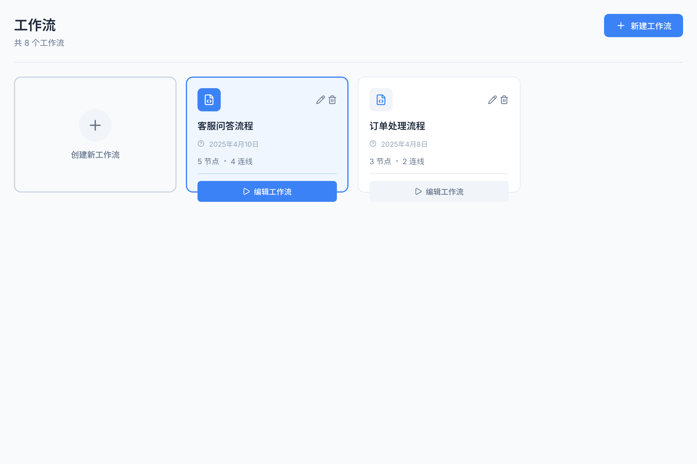
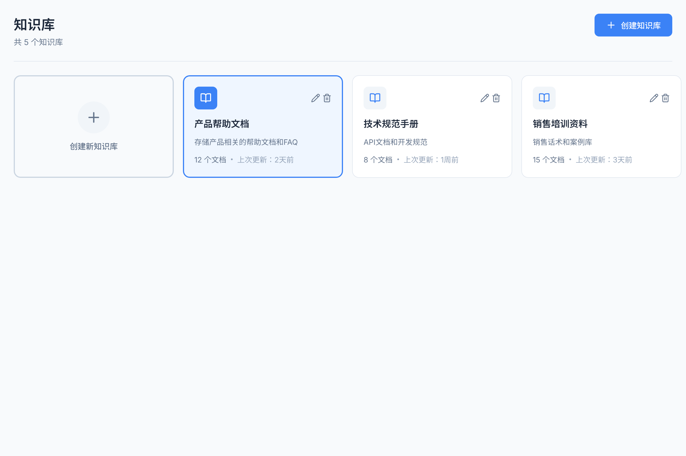
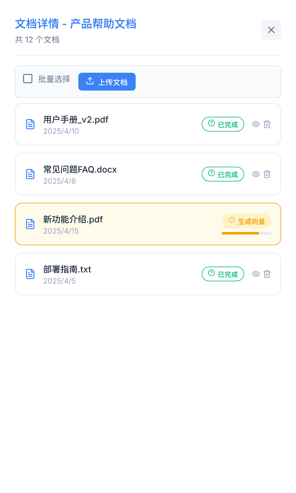

# LOOM - AI 工作流编排与 RAG 知识库平台

> 基于 NestJS + Vue 3 的轻量级 AI 工作流平台：可视化 DAG 拓扑编排、PDF/Word/Markdown 端到端 RAG 检索与 SSE 流式对话

[](https://vuejs.org/)
[](https://nestjs.com/)
[](https://www.typescriptlang.org/)
[](./LICENSE)
[](https://github.com/qrx-joe/loom/actions/workflows/ci.yml)

---

## 项目预览

<p align="center">
  
  
  
</p>

---

## 技术栈

| 层级 | 技术 | 版本 |
|------|------|------|
| 前端框架 | Vue | 3.5.24 |
| 构建工具 | Vite | 7.2.4 |
| 状态管理 | Pinia | 3.0.4 |
| 路由 | Vue Router | 4.6.4 |
| 工作流可视化 | @vue-flow/core | 1.48.2 |
| UI 图标 | lucide-vue-next | 0.563.0 |
| 后端框架 | NestJS | 11.0.1 |
| ORM | TypeORM | 0.3.28 |
| 数据库 | SQLite3 / PostgreSQL | 5.1.7 / 8.20.0 |
| AI SDK | OpenAI SDK（兼容 DeepSeek API） | 6.18.0 |
| 文档解析 | pdf-parse / mammoth | 2.4.5 / 1.12.0 |
| 语言 | TypeScript | 5.7.3 |
| 测试 | Jest / Vitest | 30.0.0 / 4.1.4 |

---

## 技术亮点

### DAG 拓扑执行引擎
解决"工作流执行黑盒"问题——通过拓扑排序 + 循环依赖检测将无效工作流拦截在运行前，SSE 流式推送节点级执行日志，让前端实时感知进度，避免"点了运行却不知道卡在哪"的焦虑。

### 端到端 RAG 检索流水线
不依赖现成 RAG 框架，从零搭建完整链路：多格式文档解析 → 语义分片 → 向量化存储 → 混合检索（BM25 + 向量相似度）。解决 MIME 类型检测误判和 PDF 跨平台解析差异导致的文档上传失败。

### 可视化节点编辑器
基于 Vue Flow 构建，支持拖拽/点击添加节点、连线、属性配置。50 步撤销重做栈降低调试成本，条件分支节点采用策略模式求值，让复杂工作流的逻辑修改更安全。

### 类型共享与 API 基础设施
前后端共享 TypeScript 类型层，消除"接口编译通过、运行时挂掉"的隐性成本。统一响应 DTO、全局异常过滤、请求限流、SSE 装饰器封装，减少重复胶水代码。

---

## 复盘与反思

### 类型层共享的时机
面对前后端类型不同步导致"编译通过、运行挂掉"的问题，选择了抽离共享类型层而不是各自维护，因为全栈 TS 项目在第一天统一类型，重构成本远低于后期返修。

### 交互假设的验证方式
面对"拖拽添加节点"是否符合直觉的争议，选择了先做出可点击原型验证而不是直接实现完整拖拽，因为实际测试发现点击在复杂工作流中效率更高，避免了一次大规模返工。

### CI 检查的渐进策略
面对遗留项目的质量管控，选择了先非阻塞收集数据、再逐步收紧的策略，而不是一开始就阻塞提交，因为直接启用全部检查会导致提交频繁被打断，反而降低修复意愿。

### 文件上传的防御性检测
面对 MIME 类型检测对 .docx 返回 `application/octet-stream` 的问题，选择了扩展名回退检测作为兜底，因为浏览器 MIME 检测不可信，纯依赖客户端会导致文档解析失败。

### SSE 连接的生命周期管理
面对流式输出在断网或服务端异常时的连接泄露，选择了封装 SSE 装饰器统一管理关闭逻辑，因为流式接口的错误边界比 REST API 更复杂，需要显式状态机。

---

## 快速开始

### 环境要求

- **Node.js** 18+ （推荐 24+）
- **npm** 9+ 或 **pnpm**

### 安装启动

#### 方式一：一键启动（Windows）

```bash
start.bat
```

#### 方式二：分别启动

```bash
# 1. 安装所有依赖
npm run install:all

# 2. 同时启动前后端
npm start

# 或分别启动
npm run dev:backend   # 后端 http://localhost:3001
npm run dev:frontend  # 前端 http://localhost:5173
```

#### 方式三：手动启动

**后端：**
```bash
cd backend
npm install
npm run start:dev
```

**前端：**
```bash
cd frontend
npm install
npm run dev
```

### 访问应用

打开浏览器访问：**http://localhost:5173**

---

## 系统架构

```
┌─────────────────────────────────────────────────────────┐
│                      Frontend (Vue3)                     │
│  ┌──────────┐  ┌──────────────┐  ┌─────────────────┐   │
│  │ FlowCanvas│  │ KnowledgeBase │  │   ChatWidget    │   │
│  │ (工作流)  │  │   Manager     │  │   (问答)        │   │
│  └─────┬────┘  └──────┬───────┘  └────────┬────────┘   │
│        │              │                    │             │
│        └──────────────┼────────────────────┘             │
│                       │                                  │
│              ┌────────▼────────┐                        │
│              │   Pinia Store   │                        │
│              └────────┬────────┘                        │
└────────────────────────┼────────────────────────────────┘
                         │ HTTP/REST
┌────────────────────────┼────────────────────────────────┐
│                      Backend (NestJS)                    │
│  ┌─────────────┐  ┌─────────────┐  ┌─────────────────┐  │
│  │ Workflow    │  │ Knowledge   │  │   Chat Agent    │  │
│  │ Service     │  │ Service     │  │   Service       │  │
│  │ - Executor  │  │ - Retrieval │  │ - LLM Gateway   │  │
│  │ - Scheduler │  │ - Vector    │  │ - Session Mgmt  │  │
│  └──────┬──────┘  └──────┬──────┘  └────────┬────────┘  │
│         │                │                   │          │
│         └────────────────┼───────────────────┘          │
│                          │                               │
│                   ┌──────▼──────┐                        │
│                   │   SQLite    │                        │
│                   │  Database   │                        │
│                   └─────────────┘                        │
└─────────────────────────────────────────────────────────┘
                          │
                   ┌──────▼──────┐
                   │  LLM API    │
                   │ (DeepSeek)  │
                   └─────────────┘
```

---

## 核心特性

- **可视化工作流编排** — 拖拽/点击添加节点、连线、属性配置，支持 6 种节点类型
- **知识库 RAG 检索** — PDF / Word / Markdown / TXT 上传、自动分片、向量化存储、混合检索
- **AI 对话** — 集成 DeepSeek 等大模型，SSE 流式输出、多轮对话
- **工作流执行** — 拓扑排序执行、循环依赖检测、SSE 实时推送节点日志
- **编辑器体验** — 50 步撤销重做、条件分支策略求值
- **响应式 UI** — 工业靛蓝风格，适配多端

---

## 项目结构

```
loom/
├── backend/                    # NestJS 后端
│   ├── src/
│   │   ├── workflow/           # 工作流模块（执行引擎、控制器、服务）
│   │   ├── knowledge/          # 知识库模块（检索、解析、分片、向量化）
│   │   ├── chat/               # 聊天会话模块
│   │   ├── common/             # 通用模块（限流、异常过滤、DTO）
│   │   └── seeder/             # 数据初始化
│   └── loom.db                 # SQLite 数据库
│
├── frontend/                   # Vue3 前端
│   ├── src/
│   │   ├── components/         # 业务组件（FlowCanvas、KnowledgeBaseManager、ChatWidget）
│   │   ├── router/             # 路由配置
│   │   ├── store/              # Pinia 状态管理
│   │   ├── composables/        # 组合式函数
│   │   └── types/              # 类型定义
│   └── package.json
│
├── design-mockups/             # UI 设计稿
├── Docs/                       # 项目文档
└── docker-compose.yml          # PostgreSQL + pgvector 配置
```

---

## 文档

- [产品需求文档 (PRD)](./Docs/PRD.md)
- [项目架构说明](./Docs/项目架构说明.md)
- [快速入门指南](./Docs/快速入门指南.md)
- [API 文档](./Docs/API文档.md)
- [开发指南](./Docs/开发指南.md)

---

## 与 Dify/Coze 对比

| 功能 | LOOM | Dify | Coze |
|------|------|------|------|
| 工作流编排 | 基础 | 完整 | 完整 |
| 知识库 RAG | 完整 | 完整 | 完整 |
| 可视化编辑 | 完整 | 完整 | 完整 |
| 流式输出 | 支持 | 支持 | 支持 |
| HTTP 请求节点 | 支持 | 支持 | 支持 |
| 循环节点 | 不支持 | 支持 | 支持 |
| 多用户系统 | 不支持 | 支持 | 支持 |
| 代码节点 | 不支持 | 支持 | 支持 |
| 部署复杂度 | 低 | 中 | 高 |
| **核心定位** | **轻量可学习，本地一键跑通** | 企业生产级 | 生态闭环，强运营 |

**适用场景：** 学习工作流引擎和 RAG 原理、个人 AI 助手搭建、产品原型快速验证。

---

## 路线图

**工作流引擎**
- [x] 可视化 DAG 编排
- [x] 条件分支节点
- [x] HTTP 请求节点
- [x] 工作流描述
- [ ] 循环节点
- [ ] 变量管理

**RAG 与对话**
- [x] 知识库检索
- [x] AI 对话与 SSE 流式输出

**系统能力**
- [ ] 多用户系统
- [ ] 统计监控

---

## 许可证

[MIT](./LICENSE)
